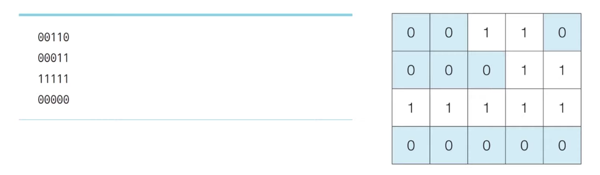

# 예제5-3. 음료수 열려먹기
교재 : 이것이 코딩 테스트다 with 파이썬
CHAPTER 5 DFS/BFS
실전문제 5-3 음료수 얼려 먹기 149p

- 난이도 ⭐️+⭐️(1/2)
풀이시간 30분 | 시간 제한 1초 | 메모리 제한 128MB

### 문제
N × M 크기의 얼음 틀이 있다. 구멍이 뚫려 있는 부분은 0, 칸막이가 존재하는 부분은 1로 표시된다.
구멍이 뚫려 있는 부분끼리 상, 하, 좌, 우로 붙어 있는 경우 서로 연결되어 있는 것으로 간주한다.
이때 얼음 틀의 모양이 주어졌을 때 생성되는 총 아이스크림의 개수를 구하는 프로그램을 작성하라.
다음의 4 × 5 얼음 틀 예시에서는 아이스크림이 총 3개가 생성된다

### 입력조건
- 첫 번째 줄에 얼음 틀의 세로 길이 N과 가로 길이 M이 주어진다. (1 <= N, M <= 1,000)
- 두 번째 줄부터 N + 1 번째 줄까지 얼음 틀의 형태가 주어진다.
- 이때 구멍이 뚫려있는 부분은 0, 그렇지 않은 부분은 1이다.

### 출력조건
- 한 번에 만들 수 있는 아이스크림의 개수를 출력한다.

### 입력 예시
4 5
00110
00011
11111
00000

### 출력 예시
3

### 입력 예시 2
15 14
00000111100000
11111101111110
11011101101110
11011101100000
11011111111111
11011111111100
11000000011111
01111111111111
00000000011111
01111111111000
00011111111000
00000001111000
11111111110011
11100011111111
11100011111111

### 출력 예시 2

----------
# 문제 해설
### 목표
- 얼음 틀의 2차원 배열에서 '0'으로 표시된 연결된 구역의 개수를 세는 것
- 그래야 아이스크림 덩어리의 개수가 나오니까!

### 왜 DFS나 BFS를 사용해야 하지?
**연결된 부분을 찾는 문제여서**
- 주어진 얼음 틀에서 연결된 '0'의 그룹을 찾는 것이 목표
- "연결된" 이라는 의미는 상하좌우로 붙어있는 '0'들끼리 연결되어 있는 것으로 간주
- 즉, 얼음 틀에서 하나의 덩어리를 찾기 위해서는 그 덩어리와 연결된 모든 '0'을 탐색해야 함

### DFS(Depth First Search) & BFS(Breadth First Search)
- DFS : 한 방향으로 가능한 깊게 탐색, 더 이상 갈 곳이 없으면 돌아가서 다른 방향을 탐색하는 방법. 보통 **스택**을 사용하여 구현
- BFS : 현재 위치에서 가능한 모든 방향으로 탐색하고, 각 방향에서 새로운 위치를 차례로 탐색하는 방법. 보통 **큐**를 사용하여 구현

두 알고리즘 모두 2차원 배열에서 연결된 부분을 탐색하는 데 유용!
즉, 얼음 틀 하나의 아이스크림 덩어리를 찾기 위해, 해당 덩어리와 연결된 모든 '0'을 탐색하는 데 적합!

### 방문 처리는 왜 필요할까
- 방문처리 : 이미 탐색한 위치를 다시 탐색하지 않기 위함
- 만약 방문처리를 하지 않으면, 같은 '0'을 여러 번 탐색하게 되어 중복된 작업 발생 : 올바른 아이스크림 덩어리 개수를 계산할 수 없게 됨

### 문제 해결을 위한 단계! 👣
1. 2차원 배열 순회
- 얼음 틀의 모든 위치 순회하며 0이 있는지 확인
2. 연결된 0 탐색
- 발견된 0은 하나의 아이스크림 덩어리로 간주, 그 덩어리에 연결된 모든 0 탐색 (이 탐색은 DFS나 BFS를 통함)
3. 방문 처리
- 탐색하는 동안 0이 방문된 것으로 표시하여 같은 0을 다시 탐색하지 않도록 함
4. 카운트 증가
- 하나의 덩어리(즉, 하나의 아이스크림)를 탐색한 후, 아이스크림의 개수를 1증가시킴

### 탐색절차 요약
1. 전체 배열 순회 : 얼음 틀의 모든 위치 순회하면서 아직 방문하지 않은 0 찾기
2. 탐색 시작 : 아직 방문하지 않은 0을 발견하면, 이것이 새로운 아이스크림 덩어리의 시작점으로 간주! 이 위치에서 DFS 또는 BFS 탐색을 시작
3. DFS/BFS 탐색 :
- 상하좌우로 탐색 : 현재 위치에서 상하좌우로 인접한 위치 탐색
    
    - 상 : 현재 위치에서 위쪽으로 이동
    - 하 : 현재 위치에서 아래쪽
    - 좌 : 현재 위치에서 왼쪽
    - 우 : 현재 위치에서 오른쪽

- 방문 체크 및 조건 확인
    
    - 범위 확인 : 이동한 위치가 배열 범위 내에 있는가
    - 방문 여부 확인: 이동한 위치가 이미 방문한 곳인가
    - 값 확인: 이동한 위치의 값이 0인가 (1이면 탐색X)

4. 방문 처리 : 탐색 중에 방문한 위치는 방문된 것으로 표시하여 중복 탐색을 방지

5. 탐색 완료 후 카운트 증가 : 하나의 아이스크림 덩어리를 모두 탐색한 후, 아이스크림 개수를 1 증가

