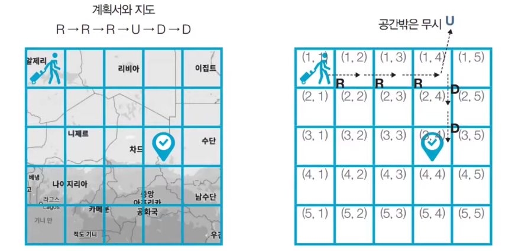

# 예제4-1. 상하좌우
교재 : 이것이 코딩 테스트다 with 파이썬
CHAPTER 3 구현
실전문제 4-1 상하좌우 110p

- 난이도 ⭐️
풀이시간 15분 | 시간 제한 1초 | 메모리 제한 128MB

### 문제
여행가 A는 N × N 크기의 정사각형 공간 위에 서 있다. 이 공간은 1 × 1 크기의 정사각형으로 나누어져 있다.
가장 왼쪽 위 좌표는 (1, 1)이며, 가장 오른쪽 아래 좌표는 (N, N)에 해당한다.
여행가 A는 상, 하, 좌, 우 방향으로 이동할 수 있으며, 시작 좌표는 항상 (1, 1)이다. 우리 앞에는 여행가 A가
이동할 계획이 적힌 계획서가 놓여 있다

계획서에는 하나의 줄에 띄어쓰기를 기준으로 L, R, U, D 중 하나의 문자가 반복적으로 적혀있다.
각 문자의 의미는 다음과 같다

L: 왼쪽으로 한 칸 이동
R: 오른쪽으로 한 칸 이동
U: 위로 한 칸 이동
D: 아래로 한 칸 이동

이때 여행가 A가 N × N 크기의 정사각형 공간을 벗어나는 움직임은 무시된다
예를 들어 (1, 1)의 위치에서 L 혹은 U를 만나면 무시된다
다음은 N = 5인 지도와 계획이다

### 입력조건
- 첫째 줄에 공간의 크기를 나타내는 N이 주어집니다. (1<=N<=100)
- 둘째 줄에 여행가 A가 이동할 계획서 내용이 주어집니다. (1<=이동 횟수<=100)

### 출력조건
- 첫째 줄에 게임의 룰에 맞게 선택한 카드에 적힌 숫자를 출력

### 입력 예시
5
R R R U D D

### 출력 예시
3 4